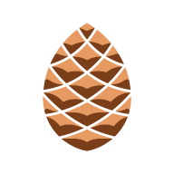
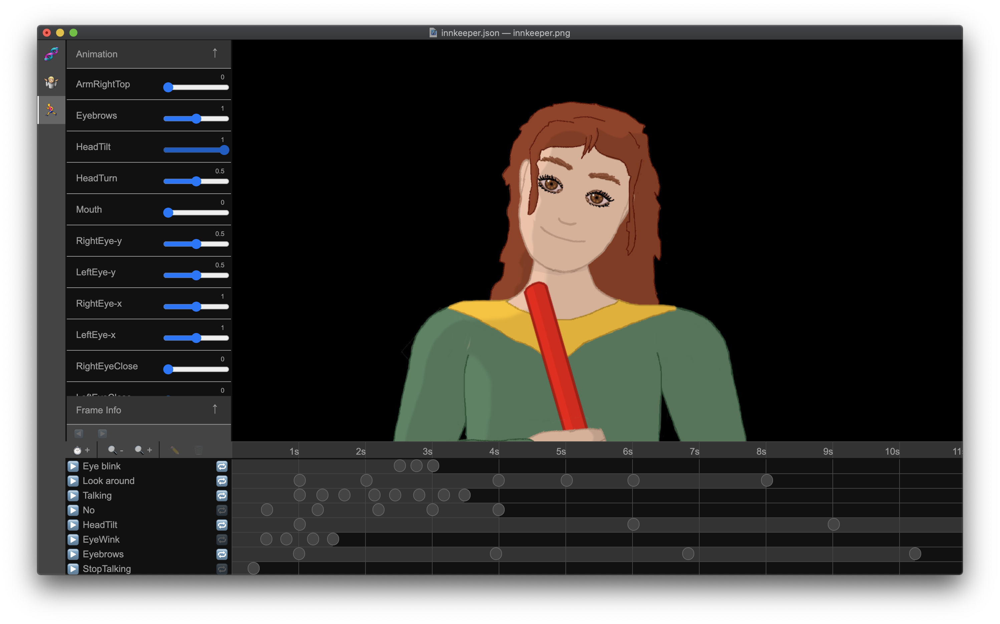

# Geppetto

Geppetto is a free and open animation tool to create and embed webGL animations in a web site. This is the repository for the browser app to create the animations.

- [Geppetto website](https://geppetto.js.org/)
- [Geppetto JavaScript Player library](./packages/player/)
- [Discussions](https://github.com/matthijsgroen/geppetto/discussions)

## Geppetto - NEXT

This is the branch for the Geppetto Studio 'next' where the studio application will be turned into a PWA, saying goodbye to the electron app. For the electron app version, check the `main` branch.

## What is Geppetto?

Geppetto consists of two parts. A [web application](https://geppetto.js.org/app) to define animated images, and a [JavaScript library](https://www.npmjs.com/package/geppetto-player) to play them.

## How does it work?

You need to create a texture file as .PNG. in Geppetto you will make layers from your texture, and compose them into your image. Next step is to add mutations to your layer tree to create motion. You can then create timelines to define multiple animations.

These animations (the created .json file and your texture .png) can then be loaded using [the geppetto player](https://www.npmjs.com/package/geppetto-player) and embedded in a website or electron app.

## Available Scripts

Yarn scripts to get started with this repo:

- `yarn studio-dev` Starts the studio app in development mode
- `yarn test` Running tests
- `yarn build` Create production builds

## Special thanks

- Guido Theelen, for creating the Geppetto logo

# License

[MIT](./LICENSE) (c) [Matthijs Groen](https://bvsky.app/profile/matthijsgroen.bsky.social)
